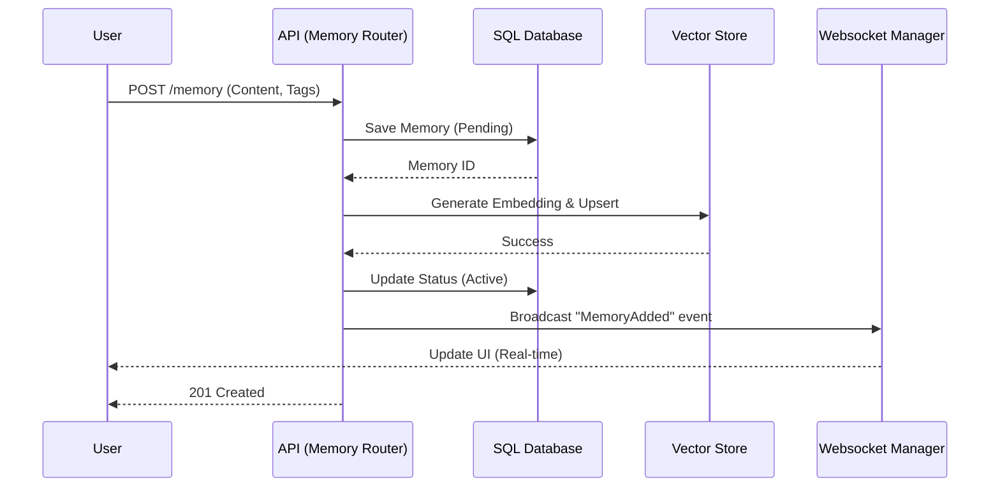
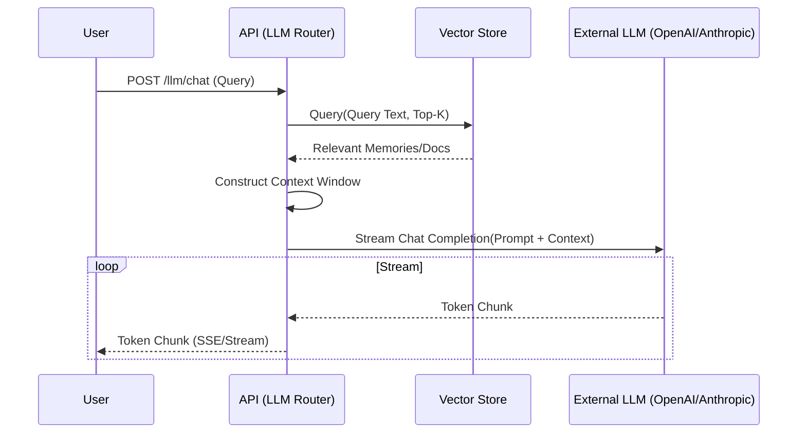
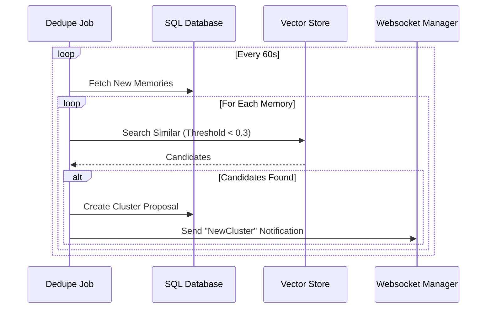
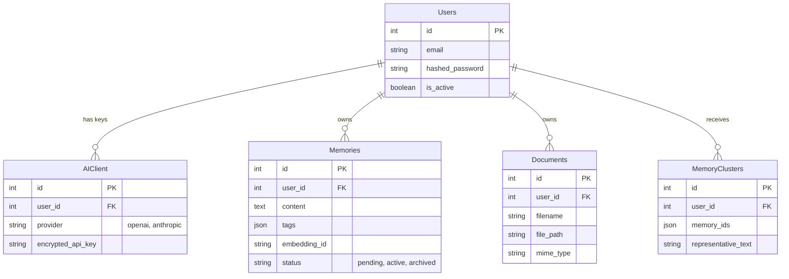

# detailed System Design - Brain Vault

## 1. High-Level Architecture (Component View)

```mermaid
graph TB
    subgraph Client_Side [Client Side]
        Browser[WebApp (Vue.js)]
        Extension[Chrome Extension]
    end

    subgraph Load_Balancer [Ingress]
        Nginx[Reverse Proxy / LB]
    end

    subgraph Backend_Core [Backend API (FastAPI)]
        Auth_Mod[Auth & Users]
        Mem_Mod[Memory Management]
        Doc_Mod[Document Processing]
        LLM_Mod[LLM Orchestration]
        WS_Mod[Real-time Notification]
    end

    subgraph Background_Workers [Async Workers]
        Dedupe_Worker[Deduplication Job]
        Vector_Ingest[Vector Ingestion]
    end

    subgraph Data_Persistence [Data Layer]
        Postgres[(Relational DB - Users/Metadata)]
        Chroma[(Vector DB - Embeddings)]
        FileSystem[File Storage (MinIO/Local)]
    end

    Browser -->|HTTPS| Nginx
    Extension -->|HTTPS| Nginx
    Nginx --> Backend_Core
    
    Auth_Mod --> Postgres
    
    Mem_Mod --> Postgres
    Mem_Mod --> Chroma
    Mem_Mod --> WS_Mod
    
    Doc_Mod --> FileSystem
    Doc_Mod --> Vector_Ingest
    
    Vector_Ingest --> Chroma
    Dedupe_Worker --> Postgres
    Dedupe_Worker --> Chroma
    Dedupe_Worker --> WS_Mod
    
    WS_Mod -->|Websocket| Browser
```

## 2. Core Workflows (Sequence Diagrams)

### 2.1 Memory Creation & Ingestion Flow


### 2.2 LLM Interaction with RAG


### 2.3 Background Deduplication


## 3. Database Schema (ER Diagram)



## 4. Application Structure (JSON)

```json
{
  "system": "Brain Vault",
  "layers": [
    {
      "name": "Frontend",
      "tech": ["Vue 3", "Vite", "TailwindCSS"],
      "modules": {
        "Views": ["Dashboard", "Editor", "Login", "Settings"],
        "Components": ["UnifiedList", "MarkdownEditor", "Sidebar"],
        "State": "Pinia"
      }
    },
    {
      "name": "Backend API",
      "tech": ["FastAPI", "Python 3.10", "Pydantic"],
      "routers": [
        { "path": "/auth", "desc": "OAuth2 / JWT Handling" },
        { "path": "/memory", "desc": "CRUD, Tagging" },
        { "path": "/retrieval", "desc": "Vector Semantic Search" },
        { "path": "/user/llm-keys", "desc": "Secure Key Management" },
        { "path": "/ws", "desc": "Websocket Endpoint" }
      ]
    },
    {
      "name": "Services",
      "components": [
        { "name": "VectorStore", "impl": "ChromaDB", "desc": "Embedding management" },
        { "name": "DedupeService", "impl": "Async/Background", "desc": "Similarity clustering" },
        { "name": "EncryptionService", "impl": "Fernet", "desc": "At-rest encryption" }
      ]
    }
  ]
}
```
